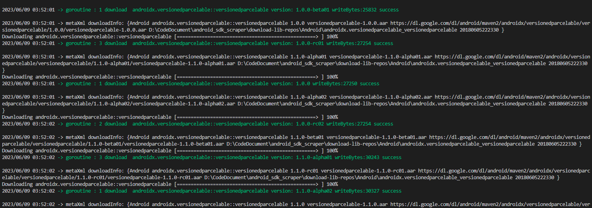
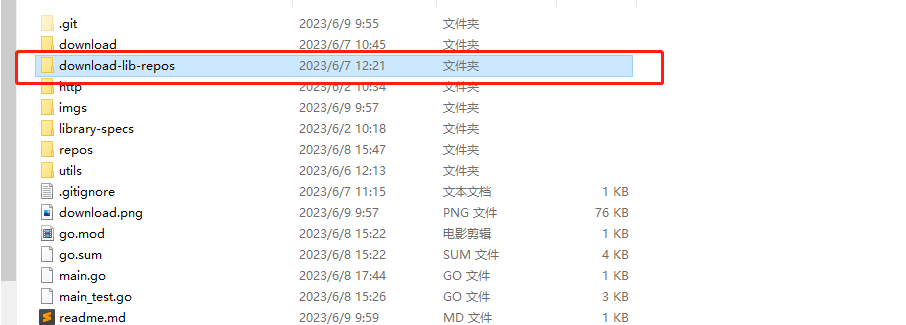
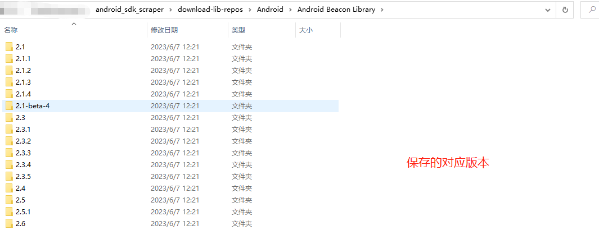

# Android Sdk Scraper 

## 本项目仅用于学习使用，如果使用该项目爬取出现违法违规行为等，与本人无关！！！
`Android Thirdpart sdk scraper` 用来爬取仓库的第三方sdk信息。这个使用go重写了[LibScout](https://github.com/reddr/LibScout)内的脚本下载。目的是提取`Android thirdpart sdk`的特征用于标识第三方sdk信息,目前这个仓库主要爬取以下仓库，可以同时支持10个并发下载

* maven
* google
* jcenter

在爬取完成后，可以使用`LibScout` 进行特征提取写入`profiles`内，为`libscout` 分析sdk特征信息做准备。

除一些官方的sdk外，还有一些不公开的sdk，例如人脸识别等，这种可以通过人工收集部分来源作为资料参考。

## 使用方式
```sh
执行 go run main.go
```
可以在当前目录下生成`download-lib-repos` 同时按照分类进行保存，如下




## 注意
为了防止爬取时被封ip等，目前将并发限制在了`3` 如果要调整，可以修改`download/downloader.go`内的`MAX_POOL`字段
```go
const (
	MAX_POOL = 3 //同时支持3个协程执行即可
)
```
如果想要爬取更快，可以调整该数值即可。
## 致谢
[LibScout](https://github.com/reddr/LibScout)


